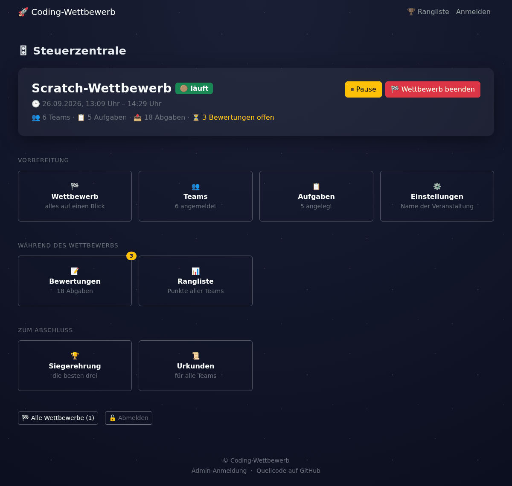
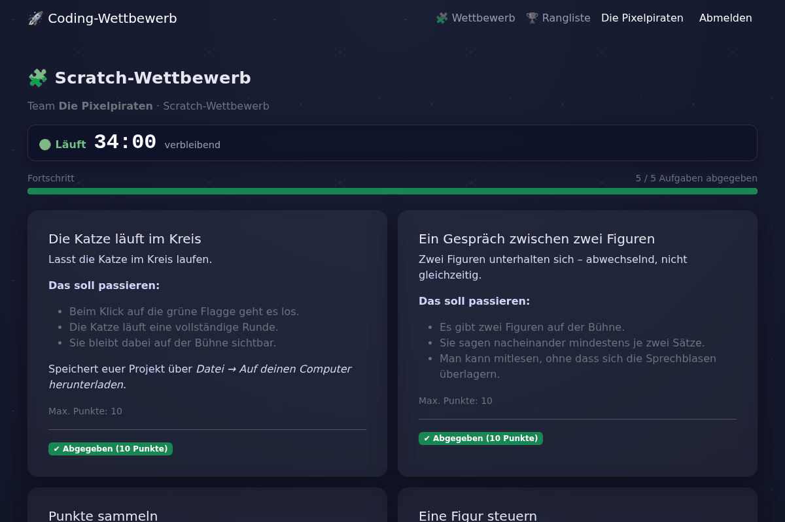
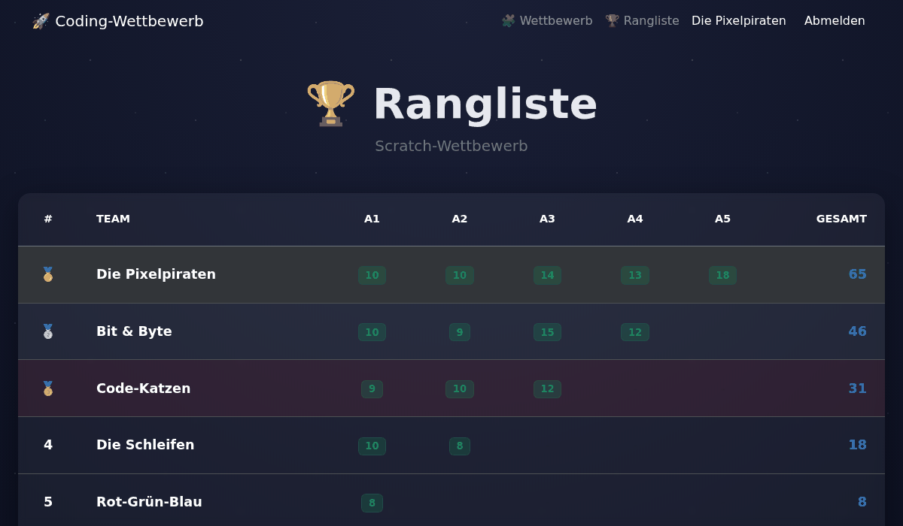
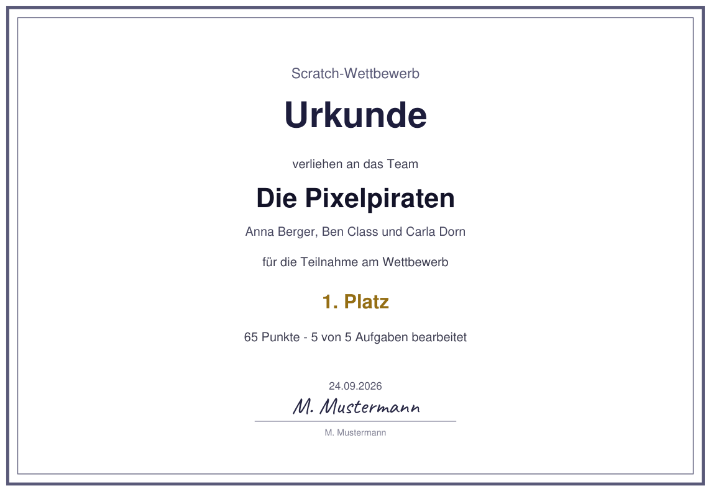

# 🚀 Coding-Wettbewerb-Plattform

Eine Flask-basierte Webanwendung für Coding-Challenges, Hackathons und Programmier-Wettbewerbe an Schulen — läuft komplett lokal im eigenen Netzwerk, **ganz ohne Internetzugriff**.


[](https://github.com/Obi-Wahn/challenge_plattform/actions/workflows/tests.yml)


## 📸 So sieht es aus

| Steuerzentrale (Lehrkraft) | Teamansicht (Schülerinnen und Schüler) |
| --- | --- |
|  |  |

| Rangliste | Urkunde |
| --- | --- |
|  |  |

## 🌟 Features

### Für Teilnehmer
*   **Team-Registrierung & Login**: Sichere Anmeldung mit Teamnamen und Passwort.
*   **Wettbewerbsseite**: alle Aufgaben des laufenden Wettbewerbs mit Fortschrittsanzeige,
    eigenen Punkten und dem Feedback der Lehrkraft.
*   **Datei-Uploads je nach Aufgabe**: Processing (`.pde`), Scratch (`.sb`/`.sb3`), Python (`.py`), Java (`.java`), MakeCode/Calliope (`.hex`/`.mkcd`).
*   **Hinweise pro Aufgabe**: Admins können während des Events optionale Tipps freischalten, falls ein Team nicht weiterkommt.
*   **Rangliste**: Punkte pro Aufgabe und Gesamtstand, lädt sich alle 30 Sekunden selbst neu –
    so kann sie während des Wettbewerbs am Beamer stehen bleiben.
*   **Countdown-Seite**: zeigt, wann es losgeht oder wie viel Zeit noch bleibt –
    ebenfalls zum Projizieren gedacht.
*   **Siegerehrung**: Podium der besten drei, das sich Platz für Platz aufdecken lässt
    (Leertaste oder Knopf) – für den Abschluss vor der Klasse.
*   **Gleichstand kostet keinen Platz**: Teams mit gleicher Punktzahl teilen sich
    einen Platz, und der nächste Platz rückt nach – bei 10, 10, 8, 8, 7 Punkten gibt
    es also einen ersten, einen zweiten und einen dritten Platz, jeweils doppelt
    besetzt bis auf den dritten. So bleibt bei Gleichstand kein Platz auf dem Podium
    leer, und keine Reihenfolge wird willkürlich entschieden.
*   **Korrektur nach Freigabe**: Gibt die Lehrkraft eine Abgabe frei, darf das Team sie
    genau einmal ersetzen.
*   **Eigene Urkunde als PDF**: Sobald der Wettbewerb beendet ist, kann jedes Team seine
    Urkunde selbst herunterladen.
*   **Namen für die Urkunde**: Hat die Lehrkraft es freigeschaltet, tragen die Schüler
    ihre Namen selbst ein – einen pro Zeile. Auf die Urkunde kommen sie erst, wenn die
    Lehrkraft sie kontrolliert und freigegeben hat; ändert das Team danach noch etwas,
    muss sie erneut freigeben.
*   **QR-Code auf der Startseite**: zum schnellen Beitreten per Smartphone, z. B. wenn die Seite beamt wird.
*   **Responsive Design**: für Desktop, Tablet und Smartphone optimiert.

### Für Administratoren
*   **Steuerzentrale**: zeigt den aktuellen Wettbewerb mit Zustand, Teams, Aufgaben und
    offenen Bewertungen; die Kacheln sind nach Vorbereitung, Während des Wettbewerbs
    und Zum Abschluss sortiert.
*   **Wettbewerbs-Seite**: alles zu einem Wettbewerb an einem Ort – Aufgaben, Teams,
    Bewertungen, Countdown, Rangliste, Siegerehrung und Urkunden.
*   **Wettbewerb beenden**: ein Knopf sperrt die Abgaben und macht den Weg frei für
    Rangliste, Siegerehrung und Urkunden. „Wieder öffnen“ macht das rückgängig.
*   **Wettbewerbs-Verwaltung**: Erstellen, Aktivieren, Pausieren und Beenden.
*   **Teams gehören zu ihrem Wettbewerb**: derselbe Teamname darf in mehreren Wettbewerben
    vorkommen; beim Anlegen eines neuen Wettbewerbs lassen sich die alten Teams übernehmen,
    mit Passwort und den Namen für die Urkunde. Die Freigabe der Namen kommt nicht mit.
*   **Aufgaben-Konfiguration**:
    *   Erstellen von Aufgaben mit detaillierten Beschreibungen.
    *   **Markdown Support**: Aufgabenbeschreibungen werden mit Markdown formatiert.
    *   **Dateiformat-Wahl**: Festlegen des erlaubten Dateityps pro Aufgabe.
    *   Optionale Hinweise, die während des Events sichtbar/unsichtbar geschaltet werden können.
    *   **Sichern und Wiederverwenden**: Aufgaben lassen sich als JSON-Datei herunterladen –
        einzeln oder alle zusammen – und in einen anderen Wettbewerb einlesen. Die Datei enthält nur die Aufgaben –
        keine Abgaben und keine Punkte – und lässt sich in jedem Texteditor bearbeiten
        oder an Kolleginnen und Kollegen weitergeben.
*   **Review-System**:
    *   Anzeige eingereichter Lösungen inklusive **Aufgabenbeschreibung**.
    *   **In-Browser Code Preview**: Code direkt im Browser lesen – bei
        Textformaten (`.pde`, `.py`, `.java`), und erst beim Aufklappen
        nachgeladen, damit die Seite auch bei vielen Abgaben schnell bleibt.
        Ein Scratch- oder MakeCode-Projekt ist eine gepackte Datei und lässt
        sich nicht als Text lesen; dort führt der Weg über den Download.
    *   Download-Option für lokale Tests.
    *   Bewertung mit Punkten (automatisch auf 0–Max. begrenzt) und Feedback.
    *   **Korrektur freigeben**: Eine Abgabe für das Team wieder öffnen; es darf dann genau
        einmal neu hochladen. Die bisherige Bewertung wird dabei zurückgesetzt, die Abgabe
        landet wieder in der Warteschlange.
    *   **Abgabe löschen**: Möglichkeit, fehlerhafte Abgaben komplett zu entfernen, damit Teams neu einreichen können.
*   **Team-Verwaltung**: Übersicht der Teams des aktuellen Wettbewerbs, inklusive
    Passwort-Reset, falls ein Team sein Passwort vergisst. Hier werden auch die
    **Namen der Teammitglieder kontrolliert**: berichtigen, freigeben oder die Freigabe
    wieder zurücknehmen. Eine Zeile oben zeigt, wie viele Teams noch auf die Kontrolle
    warten.
*   **Urkunden**: Druckansicht und PDF für alle Teams, dazu eine Urkunde einzeln – auch
    für einen längst beendeten Wettbewerb, mit den Punkten und dem Namen von damals.
    Wer bei der Siegerehrung gefehlt hat, bekommt seine Urkunde so später noch.
    Wahlweise im **Quer- oder Hochformat** (A4), einstellbar für PDF und Druckansicht
    gemeinsam. Unter die Unterschriftslinie lässt sich ein Name eintragen – wahlweise
    in einer von drei Handschriften (Caveat, Dancing Script, Great Vibes) oder in
    Druckschrift. Ohne Eintrag steht dort wie bisher „Unterschrift“ zum
    Unterschreiben von Hand. Sind für ein Team Namen freigegeben, stehen sie als
    Aufzählung direkt unter dem Teamnamen.
*   **Eigene Fehlerseiten**: Geht etwas schief – falsche Dateiart, zu große Datei,
    abgelaufene Anmeldung, zu viele Anmeldeversuche –, steht dort ein deutscher Satz
    und ein Weg zurück statt der englischen Seite des Webservers. Die gewöhnlichen
    Missgeschicke einer Schulstunde landen gar nicht erst dort: Das Team bekommt eine
    Meldung auf seiner Wettbewerbsseite.
*   **Einstellungen**: Name und Beschreibung der Anwendung frei anpassbar, ohne Code
    zu ändern; dort wird auch freigeschaltet, ob die Teams ihre Namen eintragen dürfen.
*   **Jeder Wettbewerb heißt, wie er heißt**: Sein Name steht auf Startseite,
    Countdown-Seite, Teamseite und auf seinen Urkunden – einmal „Scratch-Wettbewerb“,
    in der nächsten Runde „Calliope-Wettbewerb“ – und bleibt dort auch, wenn längst
    ein anderer läuft. Einen eigenen Untertitel darf ein Wettbewerb dazu tragen; lässt
    er ihn leer, gilt der aus den Einstellungen. Der Name aus den Einstellungen benennt
    die Anwendung selbst: Browsertitel, Leiste oben und Fußzeile, auch auf Seiten ohne
    Wettbewerb.

## 🛠 Technologien

*   **Backend**: Python, Flask, SQLAlchemy (SQLite), waitress (Produktiv-WSGI-Server).
*   **Frontend**: HTML5, CSS3, Bootstrap 5, Markdown-Editor (EasyMDE) — alle Assets liegen lokal im Repo (`static/vendor/`), keine CDN-Abhängigkeit, funktioniert komplett offline.
*   **PDF**: fpdf2 für die Urkunden. Die Handschriften unter `static/vendor/fonts/` stehen
    unter der SIL Open Font License (Lizenztexte liegen daneben) und sind mit im Repo,
    damit die Urkunden auch ohne Internet entstehen.
*   **Sicherheit**:
    *   Passwort-Hashing (Werkzeug Security).
    *   CSRF Protection (Flask-WTF).
    *   Rate-Limiting auf Login-Routen (Flask-Limiter).
    *   Secure Filename Handling.
    *   Kein Debug-Modus im Normalbetrieb (nur über `FLASK_DEBUG=true` für lokale Entwicklung).
*   **Architektur**: Modularer Aufbau mit Flask Blueprints und Application Factory Pattern.

## 🚀 Installation & Setup

Voraussetzung: Python 3.10 oder höher (fpdf2, das die Urkunden erzeugt, verlangt diese Version).
Unter Windows beim Installieren von [python.org](https://www.python.org/downloads/)
„Add python.exe to PATH“ ankreuzen.

### Der einfache Weg: Startdatei öffnen

1.  **Herunterladen** – entweder als ZIP von der
    [Release-Seite](https://github.com/Obi-Wahn/challenge_plattform/releases)
    und entpacken, oder mit git:
    ```bash
    git clone https://github.com/Obi-Wahn/challenge_plattform.git
    ```

2.  **Startdatei öffnen**

    | System | Datei | So geht's |
    |---|---|---|
    | Windows | `start_windows.bat` | doppelklicken |
    | macOS | `start_macos.command` | doppelklicken |
    | Linux | `start_linux.sh` | im Terminal `./start_linux.sh` |

Beim **ersten Start** richtet die Startdatei alles selbst ein: die virtuelle
Umgebung `.venv`, die Pakete (dafür braucht es einmal **Internet** – also
nicht erst am Wettbewerbstag im Schulnetz ausprobieren) und die `.env` mit
einem zufälligen `SECRET_KEY`. Das Admin-Passwort fragt sie einmal ab. Danach
startet die Plattform, und der Browser geht auf.

Bei **jedem weiteren Start** prüft sie nur, ob noch alles da ist, und startet
dann direkt. Fehlt etwas – ist etwa `.venv` gelöscht worden –, holt sie genau
das nach. Eine vorhandene `.env` und die Datenbank fasst sie nie an.

**Beenden** mit STRG+C im Fenster. Unter Windows fragt die Eingabeaufforderung
danach noch „Batchvorgang abbrechen (J/N)?“ – die Plattform ist da schon
beendet, J und N führen beide zum selben Ergebnis.

```text
Coding-Wettbewerb-Plattform
===========================

Python ................. 3.13.1
Virtuelle Umgebung ..... vorhanden
Pakete ................. aktuell
Konfiguration .......... vorhanden
Datenbank .............. vorhanden
```

**Wenn sich die Datei nicht öffnen lässt:**

*   **macOS** meldet bei einer heruntergeladenen Datei „nicht verifizierter
    Entwickler“: einmal mit Rechtsklick → *Öffnen* starten, bei neueren
    Fassungen unter *Systemeinstellungen → Datenschutz & Sicherheit →
    Dennoch öffnen*. Heißt es „keine Berechtigung“, hat das Entpacken das
    Ausführungsrecht verloren – im Terminal im Ordner
    `chmod +x start_macos.command` eingeben.
*   **Windows** warnt bei Dateien aus dem Internet mit „Der Computer wurde
    durch Windows geschützt“: *Weitere Informationen → Trotzdem ausführen*.
*   **Linux**: Ein Doppelklick öffnet die Datei je nach Oberfläche im Editor.
    Darum im Terminal starten; fehlt das Ausführungsrecht,
    `sh start_linux.sh`. Unter Debian und Ubuntu fehlt für die virtuelle
    Umgebung manchmal ein Paket: `sudo apt install python3-venv`.

Ohne Browserfenster, etwa auf einem Rechner ohne Bildschirm:
`./start_linux.sh --ohne-browser`.

### Aktualisieren

*   **Mit git geholt:** die Startdatei mit `--aktualisieren` aufrufen, also
    `./start_linux.sh --aktualisieren` bzw. `start_windows.bat --aktualisieren`
    in der Eingabeaufforderung. Sie holt die neue Fassung mit
    `git pull --ff-only`, installiert geänderte Pakete nach und startet.
    Sind Dateien der Plattform von Hand geändert worden, bricht sie ab,
    statt sie zu überschreiben.
*   **Als ZIP geholt:** Plattform beenden, das neue ZIP in einen **neuen**
    Ordner entpacken, aus dem alten `data/`, `uploads/` und `.env` hinüber-
    kopieren (`.env` ist oft versteckt, weil sie mit einem Punkt beginnt),
    Startdatei im neuen Ordner öffnen. `--aktualisieren` sagt dasselbe.

In beiden Fällen passt die Plattform die Datenbank beim Start selbst an,
siehe [Daten und Sicherungen](#-daten-und-sicherungen).

### Von Hand, für Entwicklung

1.  **Virtuelle Umgebung erstellen und aktivieren**
    ```bash
    python -m venv .venv
    
    # Mac/Linux:
    source .venv/bin/activate
    
    # Windows:
    .venv\Scripts\activate
    ```

2.  **Abhängigkeiten installieren**
    ```bash
    pip install -r requirements.txt
    ```

3.  **Konfiguration**
    Erstelle eine `.env` Datei im Hauptverzeichnis (siehe `.env.example`):
    ```ini
    SECRET_KEY=dein-geheimer-schluessel
    ADMIN_PASSWORD=dein-sicheres-passwort
    FLASK_DEBUG=false
    ```
    `SECRET_KEY` und `ADMIN_PASSWORD` sind Pflicht — ohne echte Werte startet die Anwendung nicht. `FLASK_DEBUG` sollte in einem Netzwerk mit mehreren Nutzern (z. B. der Schul-LAN) immer auf `false` bleiben; der eingebaute Debugger erlaubt sonst beliebige Code-Ausführung auf dem Server.

4.  **Datenbank vorbereiten**
    Beim ersten Start wird die Datenbank automatisch erstellt. Neu hinzugekommene Spalten (z. B. für die Hinweise-Funktion) werden bei bestehenden Datenbanken beim Start ebenfalls automatisch ergänzt, ohne Datenverlust.

5.  **Anwendung starten**
    ```bash
    python app.py
    ```
    Die Konsole zeigt beim Start die genaue Adresse an, unter der die Anwendung erreichbar ist — sowohl lokal (`http://localhost:8000`) als auch die Netzwerk-Adresse für andere Geräte im selben Netz.

    Diese Netzwerk-Adresse erfragt die Anwendung beim Betriebssystem. In einem
    Netz **ohne Gateway** — ein Switch, an dem nur die Rechner der Schule
    hängen — lässt sich das so nicht beantworten. Die Anwendung sagt das dann
    beim Start und nennt keine Adresse, statt eine zu nennen, die kein Gerät
    erreicht. Abhilfe: die Adresse am Server ablesen (`ip addr` bzw.
    `ipconfig`) und als `LAN_ADRESSE=192.168.1.50` in die `.env` eintragen.
    Der Eintrag sticht die Erkennung und landet auf der Startseite und im
    QR-Code.

    Die Anwendung läuft auf Port **8000**. Belegt schon ein anderes Programm
    auf dem Rechner diesen Port, startet sie nicht. Dann lässt sich der Port
    mit `PORT=8002` in der `.env` ändern; die Startmeldung, die Startseite und
    der QR-Code nennen danach den neuen Port.

## 📖 Nutzung

1.  **Admin-Zugang**:
    *   Rufe `/admin` auf (Link auch im Footer der Seite).
    *   Login mit dem in der `.env` definierten Passwort (`ADMIN_PASSWORD`).
    *   Passe unter **Einstellungen** bei Bedarf Name und Beschreibung der Veranstaltung an.
    *   Lege einen neuen Wettbewerb an.
    *   Füge Aufgaben hinzu, wähle Punkte, erlaubtes Dateiformat und optional einen Hinweis.
    *   Aktiviere den Wettbewerb.

    *   **Schnellstart:** Unter `beispiele/` liegen fertige Aufgabensätze für
        Scratch und Calliope. Auf der Aufgaben-Seite mit **⬆️ Datei einlesen**
        laden – dann steht ein kompletter Wettbewerb, den man nach Belieben
        anpassen kann.

2.  **Teilnehmer**:
    *   Registrieren sich auf der Startseite (oder scannen den dort angezeigten QR-Code).
    *   Werden direkt zum aktiven Wettbewerb weitergeleitet.
    *   Können Lösungen im geforderten Format hochladen.

## 🧭 Leitfaden für den Wettbewerbstag

Wie ein Wettbewerb **abläuft** – was eine Woche vorher, am Vortag, während
des Wettbewerbs und danach zu tun ist, und was zu tun ist, wenn etwas klemmt –
steht in **[docs/ADMIN_GUIDE.md](docs/ADMIN_GUIDE.md)**.

## 🔄 Frontend-Bibliotheken aktualisieren

Bootstrap, EasyMDE, Font Awesome und die Handschriften liegen als Dateien
unter `static/vendor/` im Repo – nur so funktioniert die Anwendung ohne
Internet. Der Preis dafür: Sie aktualisieren sich nicht von selbst. Welche
Fassungen dort liegen, steht in `static/vendor/versionen.json`.

Nachsehen, ob es neuere gibt (ändert nichts):

```bash
python werkzeuge/vendor_aktualisieren.py --pruefen
```

```
  bootstrap                 5.3.8      aktuell
  easymde                  2.21.0      aktuell
  fontawesome-free          6.7.2  ->  7.3.1     (neue Hauptversion - Darstellung vorher prüfen)
  caveat                    0.4.2      aktuell

Zum Übernehmen:
  python werkzeuge/vendor_aktualisieren.py --setzen fontawesome-free=7.3.1
  python werkzeuge/vendor_aktualisieren.py
```

Die Namen in der linken Spalte sind genau die, die `--setzen` annimmt – ohne
Leerzeichen, damit sie sich auch in der PowerShell eintippen lassen. Danach:

```bash
pytest
python app.py     # und die Seiten einmal ansehen
```

Das Skript holt die Dateien aus der npm-Registry, prüft die Prüfsumme und
ersetzt nur das, was sich geändert hat. Es braucht Internet – also am
heimischen Rechner ausführen, nicht während eines Wettbewerbs. Bei einer
**neuen Hauptversion** (der ersten Zahl) lohnt der Blick in die Oberfläche
besonders: Dort ändern sich schon mal Klassennamen oder Symbole.

## 🐍 Python-Pakete aktuell halten

Die Pakete in `requirements.txt` sind auf feste Fassungen genagelt – so läuft
auf dem Schul-PC genau das, was hier getestet wurde. Der Preis: Sie
aktualisieren sich nicht von selbst, und niemand sagt einem, wenn eine
Sicherheitskorrektur erschienen ist.

Nachsehen, ob es Neueres gibt (ändert nichts):

```bash
python werkzeuge/pakete_pruefen.py
```

```
  requirements.txt
    Flask                       3.0.0  ->  3.1.3
    Flask-SQLAlchemy            3.1.1      aktuell
    Flask-Limiter                3.12  ->  4.1.1  (neue Hauptversion - Änderungsliste lesen)
```

Eine Fassung übernehmen:

```bash
python werkzeuge/pakete_pruefen.py --setzen Flask=3.1.3
pip install -r requirements.txt -r requirements-dev.txt
pytest
```

**Eines nach dem anderen**, nicht alle auf einmal: Sonst lässt sich bei einem
fehlgeschlagenen Test nicht sagen, welches Paket ihn verursacht hat.

Gemeldet wird auch, wenn eine neue Fassung ein neueres Python verlangt als die
Anwendung voraussetzt – dann bringt das Aktualisieren nichts, solange der
Schul-PC nicht mitzieht. Vorabfassungen (alpha, beta, rc) werden gar nicht erst
vorgeschlagen.

Das Skript braucht Internet – also am heimischen Rechner ausführen, nicht
während eines Wettbewerbs.

## 💾 Daten und Sicherungen

Ein Wettbewerb steckt in **zwei** Verzeichnissen, und für eine Sicherung
braucht man beide:

| Verzeichnis | Inhalt |
|---|---|
| `data/` | die Datenbank `challenge.db`: Teams, Aufgaben, Punkte, Bewertungen |
| `uploads/` | die abgegebenen Dateien der Teams |

Die Datenbank merkt sich zu jeder Abgabe nur den **Pfad** der Datei, nicht die
Datei selbst. Wer nur `data/` sichert, hat nach einem Ausfall zwar die
Punktestände, aber nicht die Programme, für die sie vergeben wurden. Beide
Verzeichnisse gehören **nicht** ins Repository und werden von `.gitignore`
ausgeschlossen.

Bringt eine neue Version der Anwendung eine Änderung an der Datenbankstruktur
mit, wird diese beim Start automatisch ergänzt. **Vor der ersten solchen
Änderung legt die Anwendung eine Kopie an**, zum Beispiel:

```
data/challenge-vor-teams-2026-09-20-1430.db
```

Beim Start steht dann eine Zeile wie „Datenbank vor der Änderung gesichert: …"
im Fenster. Die Kopie entsteht nur, wenn wirklich etwas geändert wird – bei
allen folgenden Starts passiert nichts mehr. Geht das Sichern schief (etwa
weil die Festplatte voll ist), bricht der Start ab, statt ungesichert
umzubauen.

**Wofür die Kopie gut ist:** Falls ein Umbau zwar durchläuft, aber nicht das
Gewünschte tut, kommt man damit an den Stand davor heran. Zum Rückgängigmachen
die aktuelle Datei zur Seite legen und die Kopie nach `data/challenge.db`
umbenennen. Alte Kopien kann man löschen, sobald klar ist, dass alles passt.

**Wofür sie nicht gut ist:** Sie ersetzt keine regelmäßige Sicherung. Sie liegt
im selben Ordner und enthält nur die Datenbank – geht die Festplatte kaputt
oder wird das Verzeichnis gelöscht, ist sie mit weg, und die abgegebenen
Dateien waren ohnehin nie darin. Vor einem echten Wettbewerb gehören deshalb
**`data/` und `uploads/`** auf einen USB-Stick.

## 📋 Protokolldatei

Fehler und wichtige Ereignisse landen in `logs/anwendung.log` – mit
Zeitstempel und der Adresse der Seite, auf der es passiert ist:

```
2026-09-20 14:32:07  ERROR    Exception on /scoreboard [GET]
Traceback (most recent call last):
  ...
```

Der Sinn: Ohne diese Datei stünde ein Traceback nur im Terminalfenster. Wer
es schließt oder den Server als Dienst laufen lässt, hätte nach einer Störung
nichts mehr in der Hand – und am Wettbewerbstag ist keine Zeit, den Fehler
noch einmal herbeizuführen.

Die Datei rotiert bei 1 MB und behält fünf ältere Stände; sie wächst also
nicht unbegrenzt. Sie gehört nicht ins Repository und wird von `.gitignore`
ausgeschlossen. Ein anderer Ort lässt sich über `LOG_DIR` in der `.env`
einstellen.

## ✅ Tests

Das Projekt bringt automatische Tests mit. Sie prüfen den ganzen Ablauf – vom
Anmelden eines Teams über Abgabe, Bewertung und Rangliste bis zu Urkunden,
Aufgaben-Export und den Datenbank-Änderungen beim Start. Nach jeder Änderung am
Code lohnt sich ein Durchlauf, besonders vor einem echten Wettbewerb.

```bash
pip install -r requirements.txt -r requirements-dev.txt
pytest
```

Die Tests laufen gegen eine eigene Datenbank in einem temporären Verzeichnis.
`data/challenge.db` wird dabei nie angefasst – ein Testlauf kann also keine
echten Wettbewerbsdaten beschädigen.

Zusätzlich prüft `ruff` den Code auf echte Fehler – unbenutzte Importe,
unbekannte Namen, Tippfehler in Variablen. Stil und Formatierung bleiben
absichtlich ungeprüft:

```bash
ruff check .
```

Beides läuft auch automatisch: Bei jedem Push und jedem Pull Request führt
GitHub dieselben zwei Befehle aus, auf Python 3.10, 3.13 und 3.14. Am Pull Request
steht dann ein grünes Häkchen oder ein rotes Kreuz – man muss also nicht
daran denken, selbst zu testen. Die Einstellungen dazu stehen in
`.github/workflows/tests.yml`.

Einzelne Bereiche lassen sich gezielt prüfen:

```bash
pytest tests/test_submissions.py       # nur die Abgaben
pytest -k "urkunde"                    # alles rund um Urkunden
pytest -v                              # mit Namen jedes einzelnen Tests
```

| Datei | prüft |
| --- | --- |
| `test_challenge_status.py` | geplant / läuft / pausiert / beendet, Countdown-Zeiten |
| `test_teams.py` | Registrierung, Anmeldung, Bindung ans Wettbewerb, Team-Verwaltung |
| `test_submissions.py` | Abgabe, Korrektur nach Freigabe, Bewertung |
| `test_scoring.py` | Rangliste und Podium, auch bei Gleichstand |
| `test_admin.py` | Steuerzentrale, Wettbewerbs-Seite, Beenden, Aktivieren |
| `test_certificates.py` | Urkunden-PDF, Unterschrift, Namen der Teammitglieder, Download durch die Teams |
| `test_mitgliedernamen.py` | Namen eintragen, kontrollieren, freigeben |
| `test_veranstaltungsname.py` | Eigener Veranstaltungsname je Wettbewerb, Urkunden für ältere Wettbewerbe |
| `test_task_exchange.py` | Aufgaben sichern und wiederverwenden |
| `test_migrations.py` | Datenbank aus einer älteren Version weiterbenutzen |
| `test_security.py` | CSRF, Passwörter, Uploads, Rate-Limit |
| `test_vendor.py` | Versionsliste und `static/vendor/` bleiben deckungsgleich |

## 📂 Projektstruktur

```
challenge_plattform/
├── start_windows.bat     # Startdateien: doppelklicken, der Rest geht von selbst
├── start_macos.command
├── start_linux.sh
├── starter.py            # was die Startdateien tun: einrichten, dann starten
├── app.py                # Einstiegspunkt
├── config.py              # Konfiguration
├── extensions.py          # Datenbank & Extensions
├── models.py               # Datenbankmodelle
├── scoring.py             # Rangliste und Podium
├── certificates.py        # Urkunden als PDF
├── task_exchange.py       # Aufgaben sichern und einlesen
├── network.py             # Adresse, unter der die Teams beitreten
├── uploads.py             # löscht Dateien mit ihrer Abgabe
├── task_rules.py          # Regeln für Aufgabenwerte, für Formular und Import
├── requirements.txt       # Abhängigkeiten
├── requirements-dev.txt   # zusätzlich zum Testen
├── pytest.ini             # Test-Einstellungen
├── ruff.toml              # Einstellungen der Fehlerprüfung
├── .github/workflows/     # Tests laufen automatisch bei jedem Push
├── .env.example            # Vorlage für die eigene .env
├── blueprints/             # Modulare Routen
│   ├── admin.py
│   ├── auth.py
│   ├── challenge.py
│   └── public.py
├── static/
│   ├── vendor/              # Lokal eingebundene Frontend-Bibliotheken (Bootstrap, EasyMDE, Font Awesome)
│   │   ├── fonts/           # Handschriften für die Unterschrift auf den Urkunden (OFL)
│   │   └── versionen.json   # welche Fassungen hier liegen
│   └── ...                  # eigenes CSS, Bilder
├── templates/               # HTML Templates
├── tests/                   # automatische Tests (pytest)
├── beispiele/               # fertige Aufgabensätze zum Einlesen
├── werkzeuge/               # Hilfsskripte (Bibliotheken und Pakete prüfen)
├── docs/
│   ├── ADMIN_GUIDE.md       # Leitfaden für den Wettbewerbstag
│   └── bilder/              # Screenshots für diese README
├── uploads/                 # Hochgeladene Abgaben (wird erstellt)
├── logs/                    # Protokolldatei (wird erstellt)
└── data/                    # SQLite Datenbank und ihre Sicherungen (werden erstellt)
```

## 🙏 Herkunft & Mitwirkende

Dieses Projekt basiert auf der ursprünglichen Version von [frankjuchim](https://github.com/frankjuchim/challenge_plattform). Ein großer Teil der hier beschriebenen Weiterentwicklung (Sicherheits-Härtung, Offline-Fähigkeit, neue Funktionen, Übersetzungen) wurde mit Unterstützung von KI (Claude Code) umgesetzt.

## 📝 Lizenz

Dieses Projekt wurde für eine Weiterbildungsmaßnahme Informatik für Lehrkräfte erstellt.
