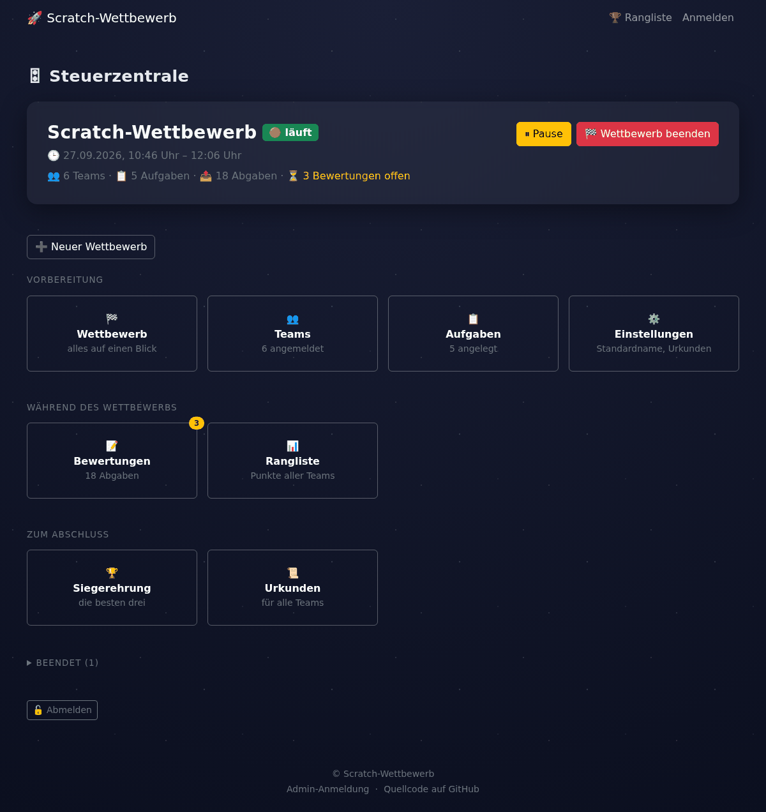
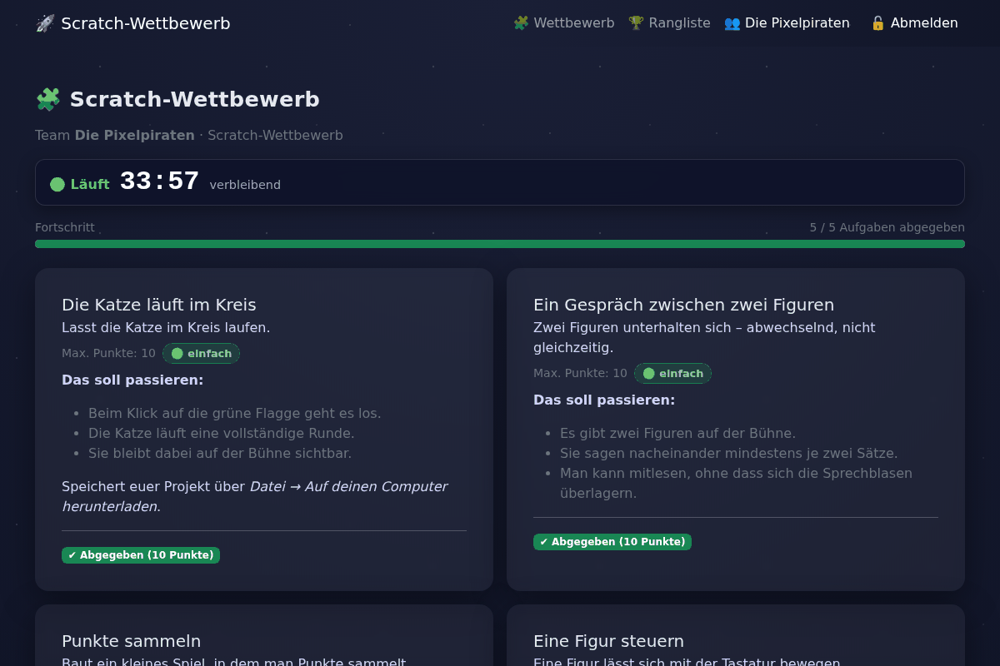
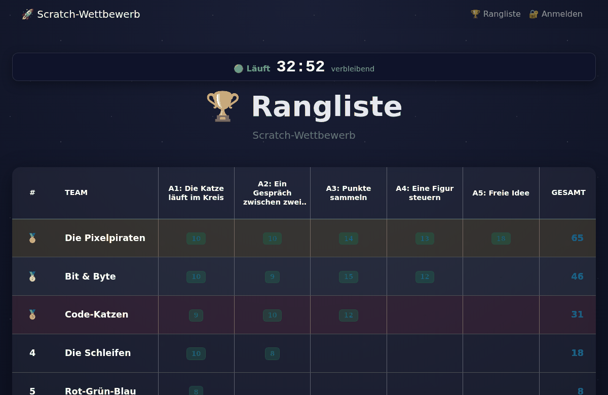
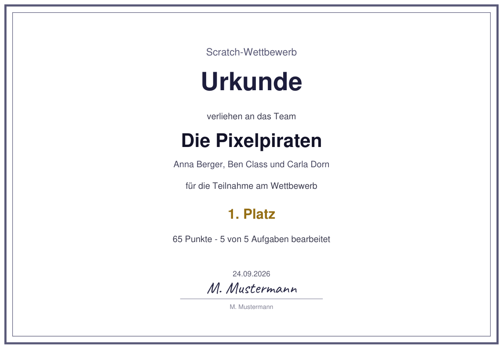

# 🚀 Coding-Wettbewerb-Plattform

Eine Flask-basierte Webanwendung für Coding-Challenges, Hackathons und Programmier-Wettbewerbe an Schulen — läuft komplett lokal im eigenen Netzwerk, **ganz ohne Internetzugriff**.


[](https://github.com/Obi-Wahn/challenge_plattform/actions/workflows/tests.yml)


## ⚡ Schnellstart

1.  [Python 3.11 oder höher](https://www.python.org/downloads/) installieren
    (unter Windows „Add python.exe to PATH“ ankreuzen).
2.  Das Projekt als ZIP von der
    [Release-Seite](https://github.com/Obi-Wahn/challenge_plattform/releases)
    herunterladen und entpacken.
3.  Die Startdatei für das eigene System öffnen: `start_windows.bat`,
    `start_macos.command` oder `start_linux.sh`. Sie richtet beim ersten Mal
    alles ein (dafür braucht es einmal Internet) und startet die Plattform.

Ausführlich, auch für die Installation mit git und von Hand:
[Installation & Setup](#-installation--setup).
Für den Wettbewerbstag selbst: [Leitfaden](#-leitfaden-für-den-wettbewerbstag).

## 📑 Inhalt

- [Schnellstart](#-schnellstart)
- [So sieht es aus](#-so-sieht-es-aus)
- [Features](#-features)
- [Technologien](#-technologien)
- [Installation & Setup](#-installation--setup)
- [Leitfaden für den Wettbewerbstag](#-leitfaden-für-den-wettbewerbstag)
- [Frontend-Bibliotheken aktualisieren](#-frontend-bibliotheken-aktualisieren)
- [Python-Pakete aktuell halten](#-python-pakete-aktuell-halten)
- [Daten und Sicherungen](#-daten-und-sicherungen)
- [Protokolldatei](#-protokolldatei)
- [Tests](#-tests)
- [Projektstruktur](#-projektstruktur)
- [Herkunft & Mitwirkende](#-herkunft--mitwirkende)
- [Lizenz](#-lizenz)

## 📸 So sieht es aus

| Steuerzentrale (Lehrkraft) | Teamansicht (Schülerinnen und Schüler) |
| --- | --- |
|  |  |

| Rangliste | Urkunde |
| --- | --- |
|  |  |

## 🌟 Features

### Für die Teams
*   **Beitritt per QR-Code**: Der Code auf der Startseite führt das Smartphone direkt hin, sonst tippt man die Adresse aus dem Schulnetz ein. Die Seiten sind für Desktop, Tablet und Smartphone gemacht.
*   **Registrierung je Wettbewerb**: Teamname und Passwort; derselbe Teamname darf in mehreren Wettbewerben vorkommen. Ist der Wettbewerb beendet oder pausiert oder gerade keiner aktiv, nimmt die Startseite keine neuen Teams an – wer schon dabei ist, kommt weiter hinein.
*   **Wettbewerbsseite**: alle Aufgaben mit Fortschritt, eigenen Punkten und dem Feedback der Lehrkraft, dazu die Restzeit als Leiste.
*   **Schwierigkeit auf einen Blick**: Unter dem einleitenden Satz jeder Aufgabe stehen Punkte und Stufe — 🟢 einfach, 🟡 mittel, 🔴 schwer.
*   **Aktualisiert sich selbst**: Die Seite fragt alle 15 Sekunden nach dem Stand — Pause, Fortsetzen, ein freigeschalteter Tipp, eine Durchsage und eine neue Dauer kommen an, ohne dass jemand neu laden muss.
*   **Abgabe je Aufgabe**: Processing (`.pde`), Scratch (`.sb`/`.sb3`), Python (`.py`), Java (`.java`), MakeCode/Calliope (`.hex`/`.mkcd`) — welches Format erlaubt ist, legt die Aufgabe fest.
*   **Tipps**: Kommt ein Team nicht weiter, schaltet die Lehrkraft den Hinweis zur Aufgabe frei.
*   **Korrektur**: Gibt die Lehrkraft eine Abgabe frei, darf das Team sie genau einmal ersetzen.
*   **Namen für die Urkunde**: Das Team trägt sie selbst ein, einen pro Zeile; auf die Urkunde kommen sie nach der Freigabe durch die Lehrkraft.
*   **Eigene Urkunde als PDF**: nach dem Ende des Wettbewerbs selbst herunterladbar, bei eingefrorener Rangliste nach der Siegerehrung.

### Für die Lehrkraft
*   **Steuerzentrale**: Zustand, Teams, Aufgaben und offene Bewertungen auf einen Blick, die Kacheln nach Vorbereitung, Während des Wettbewerbs und Zum Abschluss sortiert. Eine Linie am Rand hält zusammen, was zum laufenden Wettbewerb gehört; darunter stehen abgesetzt die Einstellungen der Installation und die anderen Wettbewerbe, die beendeten zugeklappt für sich.
*   **Wettbewerbe verwalten**: anlegen, aktivieren, pausieren, beenden, wieder öffnen und löschen – alles auf der Steuerzentrale. Welcher Wettbewerb gilt, entscheidet die Lehrkraft mit „Aktivieren“; nur ein neu angelegter wird von selbst aktiv, wenn gerade keiner es ist. Beim Anlegen lassen sich die Teams eines früheren Wettbewerbs übernehmen, mit Passwort und den Namen für die Urkunde.
*   **Eigener Name je Wettbewerb**: Name und Untertitel stehen überall – Startseite, Rangliste, Teamseite, Urkunden, Browsertitel, Leiste oben und Fußzeile – und bleiben beim Wettbewerb, wenn längst ein anderer läuft. Unter dem Namen begrüßt die Startseite die Teams, mit „Schön, dass ihr dabei seid!“ oder einem eigenen Gruß je Wettbewerb.
*   **Aufgaben**: Beschreibung in Markdown, erlaubtes Dateiformat, Schwierigkeit (einfach, mittel, schwer oder keine Angabe), optionaler Tipp; die Reihenfolge lässt sich mit ▲ und ▼ ändern. Aufgaben lassen sich als JSON sichern, weitergeben und in einen anderen Wettbewerb einlesen — ohne Abgaben und Punkte. Fertige Sätze für Scratch und Calliope liegen unter `beispiele/` und sind mit einem Klick eingelesen.
*   **Wettbewerb sichern**: ein ganzer Wettbewerb als ZIP – Aufgaben, Teams, Abgaben samt Dateien, Punkte und Feedback. Unter „Neuer Wettbewerb“ wieder eingelesen, entsteht daraus ein neuer, inaktiver Wettbewerb, etwa auf einem anderen Rechner. Die Namen für die Urkunde und die Passwörter der Teams kommen nur auf ausdrücklichen Wunsch mit, die Passwörter nie im Klartext.
*   **Aufräumen**: Bei einem beendeten Wettbewerb löscht ein Knopf alle Teams samt Namen und Passwörtern und alle Abgaben mit Dateien; Wettbewerb, Einstellungen und Aufgaben bleiben für das nächste Mal. Protokolldatei und alte Sicherungskopien der Datenbank lassen sich unter Einstellungen löschen.
*   **Zeit im Griff**: Start- und Endzeit oder eine Dauer in Minuten samt „Jetzt starten für … Minuten"; die Pause hält die Uhr an, „Fortsetzen" schiebt das Ende um die Pausendauer nach hinten.
*   **Durchsagen**: je Wettbewerb einschaltbar – ein kurzer Satz wie „Noch 10 Minuten, bitte speichern“ erscheint oben auf jeder Teamseite und über der Rangliste. Es gilt immer nur einer; ins Protokoll und in die Sicherung kommt der Text nicht.
*   **Bewerten**: Abgaben mit Aufgabenbeschreibung daneben, Textformate direkt im Browser lesbar, Download für lokale Tests, Punkte und Feedback, Korrektur freigeben oder Abgabe löschen.
*   **Teams**: Passwort zurücksetzen, die eingetragenen Namen kontrollieren, freigeben oder die Freigabe zurücknehmen; eine Zeile oben zeigt, wie viele noch auf die Kontrolle warten.
*   **Urkunden**: als PDF und Druckansicht, für alle Teams oder einzeln, im Quer- oder Hochformat, mit Namen und Handschrift unter der Unterschriftslinie — auch für einen längst beendeten Wettbewerb, mit den Punkten von damals.
*   **Einstellungen**: Standardname, -untertitel und -gruß für eine Installation, in der noch kein Wettbewerb angelegt oder keiner aktiv ist, ob über den Spalten der Rangliste die Aufgabentitel stehen, Quer- oder Hochformat der Urkunden, ob die Teams ihre Namen eintragen dürfen und Name und Handschrift unter der Unterschriftslinie; ganz unten Protokolldatei und alte Sicherungskopien aufräumen.
*   **Protokolldatei**: Was anlegt, ändert oder wegnimmt, steht mit Zeitstempel in `logs/anwendung.log` – samt jeder **abgewiesenen** Abgabe mit Grund. Damit ist „Wir haben doch abgegeben!“ nach dem Wettbewerbstag beantwortbar.
*   **Eigene Fehlerseiten**: deutscher Satz und ein Weg zurück statt der englischen Seite des Webservers. Die gewöhnlichen Missgeschicke landen gar nicht dort, sondern als Meldung auf der Wettbewerbsseite des Teams.

### Für den Beamer
*   **Rangliste**: Punkte je Aufgabe und Gesamtstand, über jeder Spalte Nummer und Titel der Aufgabe („A1: Die Katze läuft im Kreis“, der Titel lässt sich abschalten), auch mit fünfzehn Aufgaben ohne seitliches Schieben, lädt sich alle 30 Sekunden selbst neu. Oben läuft dieselbe Restzeit mit, die die Teams sehen — die Seite für den ganzen Wettbewerb.
*   **Rangliste einfrieren**: je Wettbewerb einschaltbar – ab einstellbaren Minuten vor Schluss zeigt der Beamer nur noch, was bis dahin abgegeben war. Die eigenen Punkte sieht jedes Team weiter aktuell, den echten Stand verkündet die Siegerehrung.
*   **Hell oder dunkel**: Die Seiten folgen der Einstellung des Geräts; **☀️ Hell** oder **🌙 Dunkel** in der Leiste oben wechselt, etwa für den Beamer in einem hellen Raum. Die Wahl merkt sich nur der Browser dieses Geräts, der Server speichert nichts.
*   **Siegerehrung**: Podium der besten drei, Platz für Platz aufzudecken (Leertaste oder Knopf). Bei Gleichstand teilen sich Teams einen Platz, und der nächste rückt nach: 10, 10 und 8 Punkte ergeben zwei erste Plätze und einen zweiten, kein Platz bleibt leer.

### Ohne Installationsaufwand
*   **Startdateien** für Windows, macOS und Linux richten beim ersten Öffnen alles ein und starten die Plattform.
*   **Version beim Start**: Die Übersicht nennt, welcher Stand läuft, etwa „1.7.0 (Stand 27.09.2026)“ – bei einem ZIP genauso wie bei git.
*   **Läuft im Schul-LAN, ganz ohne Internet**; Port und angezeigte Netzwerkadresse lassen sich in der `.env` setzen.

## 🛠 Technologien

*   **Backend**: Python, Flask, SQLAlchemy (SQLite), waitress (Produktiv-WSGI-Server).
*   **Frontend**: HTML5, CSS3, Bootstrap 5, Markdown-Editor (EasyMDE) — alle Assets liegen lokal im Repo (`static/vendor/`), keine CDN-Abhängigkeit, funktioniert komplett offline.
*   **PDF**: fpdf2 für die Urkunden. Die Handschriften unter `static/vendor/fonts/` stehen
    unter der SIL Open Font License (Lizenztexte liegen daneben) und sind mit im Repo,
    damit die Urkunden auch ohne Internet entstehen.
*   **Sicherheit**:
    *   Passwort-Hashing (Werkzeug Security).
    *   CSRF Protection (Flask-WTF).
    *   Rate-Limiting auf Login-Routen (Flask-Limiter).
    *   Secure Filename Handling.
    *   Kein Debug-Modus im Normalbetrieb (nur über `FLASK_DEBUG=true` für lokale Entwicklung).
*   **Architektur**: Modularer Aufbau mit Flask Blueprints und Application Factory Pattern.

## 🚀 Installation & Setup

Voraussetzung: Python 3.11 oder höher (Markdown, das die Aufgabentexte darstellt, verlangt diese Version).
Ubuntu 22.04 und Linux Mint 21 bringen noch Python 3.10 mit, dort reicht es nicht.
Unter Windows beim Installieren von [python.org](https://www.python.org/downloads/)
„Add python.exe to PATH“ ankreuzen.

### Der einfache Weg: Startdatei öffnen

1.  **Herunterladen** – entweder als ZIP von der
    [Release-Seite](https://github.com/Obi-Wahn/challenge_plattform/releases)
    und entpacken, oder mit git:
    ```bash
    git clone https://github.com/Obi-Wahn/challenge_plattform.git
    ```

2.  **Startdatei öffnen**

    | System | Datei | So geht's |
    |---|---|---|
    | Windows | `start_windows.bat` | doppelklicken |
    | macOS | `start_macos.command` | doppelklicken |
    | Linux | `start_linux.sh` | im Terminal `./start_linux.sh` |

Beim **ersten Start** richtet die Startdatei alles selbst ein: die virtuelle
Umgebung `.venv`, die Pakete (dafür braucht es einmal **Internet** – also
nicht erst am Wettbewerbstag im Schulnetz ausprobieren) und die `.env` mit
einem zufälligen `SECRET_KEY`. Das Admin-Passwort fragt sie einmal ab. Danach
startet die Plattform, und der Browser geht auf.

Bei **jedem weiteren Start** prüft sie nur, ob noch alles da ist, und startet
dann direkt. Fehlt etwas – ist etwa `.venv` gelöscht worden –, holt sie genau
das nach. Eine vorhandene `.env` und die Datenbank fasst sie nie an.

Die Umgebung bleibt an das Python gebunden, mit dem sie angelegt wurde; die
Übersicht nennt es, etwa „Virtuelle Umgebung ..... vorhanden (Python 3.13)“.
Wer auf ein neueres Python wechseln will, löscht den Ordner `.venv` und öffnet
die Startdatei – dafür braucht es wieder einmal Internet. Wird das alte Python
deinstalliert, merkt die Startdatei das und legt die Umgebung selbst neu an.
Ebenso eine Umgebung mit Python 3.10 von vor der Anhebung auf 3.11: Die Pakete
ließen sich darin nicht mehr installieren.

**Beenden** mit STRG+C im Fenster. Unter Windows fragt die Eingabeaufforderung
danach noch „Batchvorgang abbrechen (J/N)?“ – die Plattform ist da schon
beendet, J und N führen beide zum selben Ergebnis.

```text
Coding-Wettbewerb-Plattform
===========================

Version ................ 1.7.0 (Stand 27.09.2026)
Python ................. 3.13.1
Virtuelle Umgebung ..... vorhanden (Python 3.13)
Pakete ................. aktuell
Konfiguration .......... vorhanden
Datenbank .............. vorhanden
```

Die erste Zeile sagt, **welche Fassung** hier liegt. Die Nummer kommt aus
dem Release, von Hand gepflegt wird sie nirgends: Bei git fragt die
Startdatei git, bei einem ZIP hat GitHub sie beim Packen in `stand.txt`
eingetragen. Enthält der Stand Änderungen nach dem letzten Release, steht
das dabei, etwa „1.7.0 + 3 Änderungen (Stand 30.09.2026)“. Steht dort
„unbekannt“ – etwa bei einem von Hand kopierten Ordner –, läuft die
Plattform trotzdem. Die Zeile steht auch im Protokoll.

**Wenn sich die Datei nicht öffnen lässt:**

*   **macOS** meldet bei einer heruntergeladenen Datei „nicht verifizierter
    Entwickler“: einmal mit Rechtsklick → *Öffnen* starten, bei neueren
    Fassungen unter *Systemeinstellungen → Datenschutz & Sicherheit →
    Dennoch öffnen*. Heißt es „keine Berechtigung“, hat das Entpacken das
    Ausführungsrecht verloren – im Terminal im Ordner
    `chmod +x start_macos.command` eingeben.
*   **Windows** warnt bei Dateien aus dem Internet mit „Der Computer wurde
    durch Windows geschützt“: *Weitere Informationen → Trotzdem ausführen*.
*   **Linux**: Ein Doppelklick öffnet die Datei je nach Oberfläche im Editor.
    Darum im Terminal starten; fehlt das Ausführungsrecht,
    `sh start_linux.sh`. Unter Debian und Ubuntu fehlt für die virtuelle
    Umgebung manchmal ein Paket: `sudo apt install python3-venv`.

Ohne Browserfenster: `./start_linux.sh --ohne-browser`. Für einen Rechner
ohne Bildschirm siehe den nächsten Abschnitt.

### Auf einem Rechner ohne Bildschirm (etwa Raspberry Pi)

Die Plattform braucht keine Oberfläche und läuft auch auf einem kleinen
Linux-Rechner, der nur per SSH erreichbar ist. Raspberry Pi OS bringt ab
Bookworm ein passendes Python mit (3.11, bei Trixie 3.13).

1.  **Holen und einrichten**, per SSH auf dem Rechner, einmal mit Internet:
    ```bash
    git clone https://github.com/Obi-Wahn/challenge_plattform.git
    cd challenge_plattform
    ./start_linux.sh --ohne-browser
    ```
    Wer das ZIP nimmt, kopiert es vorher hinüber (etwa mit `scp`) und
    entpackt es dort mit `unzip`. Der erste Start fragt wie gewohnt das
    Admin-Passwort ab. Bedient wird die Plattform danach vom Browser eines
    anderen Geräts aus, über die Adresse in der Startübersicht.

2.  **Feste Adresse.** Bekommt der Rechner seine Adresse per DHCP, kann sie
    sich ändern – und mit ihr der QR-Code. Die Adresse darum im Router
    reservieren oder am Rechner fest einstellen (unter Raspberry Pi OS mit
    `sudo nmtui`) und als `LAN_ADRESSE=192.168.…` in die `.env` schreiben.

3.  **Uhrzeit prüfen.** Ein Raspberry Pi hat meist keine Uhr mit Batterie.
    Ohne Internet läuft er nach dem Einschalten mit der Zeit weiter, zu der er
    zuletzt lief – und Restzeit, Pause und Zeitstempel richten sich nach
    dieser Uhr. Vor dem Wettbewerb darum `timedatectl` aufrufen: Datum,
    Uhrzeit und Zeitzone (`Europe/Berlin`) müssen stimmen. Sonst von Hand
    setzen, **bevor** die Plattform startet:
    ```bash
    sudo timedatectl set-timezone Europe/Berlin
    sudo date -s "2026-10-05 08:00"
    ```
    Ein Raspberry Pi 5 mit eingesetzter Uhrbatterie oder ein RTC-Modul
    erspart das.

4.  **Weiterlaufen lassen.** Schließt man das SSH-Fenster, endet auch die
    Plattform. Der einfache Weg ist `tmux`. Es läuft **auf dem Rechner mit
    der Plattform**, also auf dem Raspberry Pi, nicht auf dem Gerät, von dem
    aus man sich per SSH verbindet. Dort einmal `sudo apt install tmux`,
    dann in der SSH-Sitzung:
    ```bash
    tmux new -s wettbewerb
    ./start_linux.sh --ohne-browser
    ```
    Mit STRG+B, dann D, löst man sich davon, die Plattform läuft weiter. Nach
    dem nächsten Anmelden holt `tmux attach -t wettbewerb` das Fenster zurück,
    dort beendet STRG+C sie wie gewohnt.

**Optional: als Dienst, der beim Einschalten startet.** Wer den Rechner nur
einstecken will, richtet einen systemd-Dienst ein. Vorher muss der erste
Start aus Schritt 1 durchgelaufen sein. Benutzer und Pfad anpassen, dann als
`/etc/systemd/system/challenge-plattform.service` speichern:

```ini
[Unit]
Description=Challenge-Plattform
After=network-online.target
Wants=network-online.target

[Service]
User=pi
WorkingDirectory=/home/pi/challenge_plattform
ExecStart=/home/pi/challenge_plattform/.venv/bin/python app.py
Restart=on-failure

[Install]
WantedBy=multi-user.target
```

```bash
sudo systemctl enable --now challenge-plattform   # einschalten und starten
sudo systemctl status challenge-plattform         # läuft er?
sudo systemctl disable --now challenge-plattform  # wieder abschalten
```

Die Uhrzeit aus Schritt 3 gilt dann genauso – der Dienst startet ja schon
beim Einschalten. Zum **Aktualisieren** den Dienst mit
`sudo systemctl stop challenge-plattform` anhalten, sonst meldet die
Startdatei den Port als belegt. Dann `./start_linux.sh --aktualisieren
--ohne-browser`, nach der Startübersicht mit STRG+C beenden und den Dienst
mit `sudo systemctl start challenge-plattform` wieder starten.

**SD-Karte.** Das Protokoll schreibt kaum etwas, der gewöhnliche Betrieb
bleibt darin still (siehe [Protokolldatei](#-protokolldatei)). Geschrieben
wird vor allem in die Datenbank und in `uploads/`, und beides wird gebraucht.
Eine SD-Karte fällt aber eher aus als eine Festplatte: nach dem Wettbewerb
sichern, wie unter [Daten und Sicherungen](#-daten-und-sicherungen)
beschrieben. Auf der Karte stehen Teamnamen und Abgaben – ein Rechner, der
danach in der Schublade liegt, wird genauso aufgeräumt wie jeder andere.

### Aktualisieren

*   **Mit git geholt:** die Startdatei mit `--aktualisieren` aufrufen, also
    `./start_linux.sh --aktualisieren` bzw. `start_windows.bat --aktualisieren`
    in der Eingabeaufforderung. Sie holt die neue Fassung mit
    `git pull --ff-only`, installiert geänderte Pakete nach und startet.
    Sind Dateien der Plattform von Hand geändert worden, bricht sie ab,
    statt sie zu überschreiben. Was dann zu tun ist, steht im Leitfaden
    unter [Wenn etwas klemmt](docs/ADMIN_GUIDE.md#-wenn-etwas-klemmt).
*   **Als ZIP geholt:** Plattform beenden, das neue ZIP in einen **neuen**
    Ordner entpacken, aus dem alten `data/`, `uploads/` und `.env` hinüber-
    kopieren (`.env` ist oft versteckt, weil sie mit einem Punkt beginnt),
    Startdatei im neuen Ordner öffnen. `--aktualisieren` sagt dasselbe.

In beiden Fällen passt die Plattform die Datenbank beim Start selbst an,
siehe [Daten und Sicherungen](#-daten-und-sicherungen).

### Von Hand, für Entwicklung

1.  **Virtuelle Umgebung erstellen und aktivieren**
    ```bash
    python -m venv .venv
    
    # Mac/Linux:
    source .venv/bin/activate
    
    # Windows:
    .venv\Scripts\activate
    ```

2.  **Abhängigkeiten installieren**
    ```bash
    pip install -r requirements.txt
    ```

3.  **Konfiguration**
    Erstelle eine `.env` Datei im Hauptverzeichnis (siehe `.env.example`):
    ```ini
    SECRET_KEY=dein-geheimer-schluessel
    ADMIN_PASSWORD=dein-sicheres-passwort
    FLASK_DEBUG=false
    ```
    `SECRET_KEY` und `ADMIN_PASSWORD` sind Pflicht — ohne echte Werte startet die Anwendung nicht. `FLASK_DEBUG` sollte in einem Netzwerk mit mehreren Nutzern (z. B. der Schul-LAN) immer auf `false` bleiben; der eingebaute Debugger erlaubt sonst beliebige Code-Ausführung auf dem Server.

4.  **Datenbank vorbereiten**
    Beim ersten Start wird die Datenbank automatisch erstellt. Neu hinzugekommene Spalten (z. B. für die Hinweise-Funktion) werden bei bestehenden Datenbanken beim Start ebenfalls automatisch ergänzt, ohne Datenverlust.

5.  **Anwendung starten**
    ```bash
    python app.py
    ```
    Die Konsole zeigt beim Start die genaue Adresse an, unter der die Anwendung erreichbar ist — sowohl lokal (`http://localhost:8000`) als auch die Netzwerk-Adresse für andere Geräte im selben Netz.

    Diese Netzwerk-Adresse erfragt die Anwendung beim Betriebssystem. In einem
    Netz **ohne Gateway** — ein Switch, an dem nur die Rechner der Schule
    hängen — lässt sich das so nicht beantworten. Die Anwendung sagt das dann
    beim Start und nennt keine Adresse, statt eine zu nennen, die kein Gerät
    erreicht. Abhilfe: die Adresse am Server ablesen (`ip addr` bzw.
    `ipconfig`) und als `LAN_ADRESSE=192.168.1.50` in die `.env` eintragen.
    Der Eintrag sticht die Erkennung und landet auf der Startseite und im
    QR-Code.

    Die Anwendung läuft auf Port **8000**. Belegt schon ein anderes Programm
    auf dem Rechner diesen Port, startet sie nicht. Dann lässt sich der Port
    mit `PORT=8002` in der `.env` ändern; die Startmeldung, die Startseite und
    der QR-Code nennen danach den neuen Port.

## 🧭 Leitfaden für den Wettbewerbstag

Der Weg hinein: `/admin` aufrufen – der Link steht auch in der Fußzeile jeder
Seite – und mit dem Passwort anmelden, das die Startdatei beim ersten Mal
abgefragt und als `ADMIN_PASSWORD` in die `.env` geschrieben hat. Den Namen,
unter dem die Teams ihren Wettbewerb sehen, trägt man beim Anlegen des
Wettbewerbs ein. Unter *Einstellungen* steht nur der Standardname für die
Zeit, in der kein Wettbewerb aktiv ist.

Wie ein Wettbewerb **abläuft** – was eine Woche vorher, am Vortag, während
des Wettbewerbs und danach zu tun ist, und was zu tun ist, wenn etwas klemmt –
steht in **[docs/ADMIN_GUIDE.md](docs/ADMIN_GUIDE.md)**.

## 🔄 Frontend-Bibliotheken aktualisieren

Bootstrap, EasyMDE, Font Awesome und die Handschriften liegen als Dateien
unter `static/vendor/` im Repo – nur so funktioniert die Anwendung ohne
Internet. Der Preis dafür: Sie aktualisieren sich nicht von selbst. Welche
Fassungen dort liegen, steht in `static/vendor/versionen.json`.

Nachsehen, ob es neuere gibt (ändert nichts):

```bash
python werkzeuge/vendor_aktualisieren.py --pruefen
```

```
  bootstrap                 5.3.8      aktuell
  easymde                  2.21.0      aktuell
  fontawesome-free          6.7.2  ->  7.3.1     (neue Hauptversion - Darstellung vorher prüfen)
  caveat                    0.4.2      aktuell

Zum Übernehmen:
  python werkzeuge/vendor_aktualisieren.py --setzen fontawesome-free=7.3.1
  python werkzeuge/vendor_aktualisieren.py
```

Die Namen in der linken Spalte sind genau die, die `--setzen` annimmt – ohne
Leerzeichen, damit sie sich auch in der PowerShell eintippen lassen. Danach:

```bash
pytest
python app.py     # und die Seiten einmal ansehen
```

Das Skript holt die Dateien aus der npm-Registry, prüft die Prüfsumme und
ersetzt nur das, was sich geändert hat. Es braucht Internet – also am
heimischen Rechner ausführen, nicht während eines Wettbewerbs. Bei einer
**neuen Hauptversion** (der ersten Zahl) lohnt der Blick in die Oberfläche
besonders: Dort ändern sich schon mal Klassennamen oder Symbole.

## 🐍 Python-Pakete aktuell halten

Die Pakete in `requirements.txt` sind auf feste Fassungen genagelt – so läuft
auf dem Schul-PC genau das, was hier getestet wurde. Der Preis: Sie
aktualisieren sich nicht von selbst, und niemand sagt einem, wenn eine
Sicherheitskorrektur erschienen ist.

Nachsehen, ob es Neueres gibt (ändert nichts):

```bash
python werkzeuge/pakete_pruefen.py
```

```
  requirements.txt
    Flask                       3.1.3      aktuell
    Werkzeug                    3.1.8  ->  3.1.9
    Flask-Limiter               4.1.1  ->  5.0.0  (neue Hauptversion - Änderungsliste lesen)
    fpdf2                       2.8.8  ->  2.9.0  (nicht übernehmen: braucht Python >=3.12, die Anwendung setzt 3.11 voraus)
```

Gekürzt; welche Fassungen dort erscheinen, hängt vom Tag ab.

Eine Fassung übernehmen:

```bash
python werkzeuge/pakete_pruefen.py --setzen Werkzeug=3.1.9
pip install -r requirements.txt -r requirements-dev.txt
pytest
```

**Eines nach dem anderen**, nicht alle auf einmal: Sonst lässt sich bei einem
fehlgeschlagenen Test nicht sagen, welches Paket ihn verursacht hat.

Verlangt eine neue Fassung ein neueres Python, als die Anwendung voraussetzt,
steht sie mit **„nicht übernehmen“** in der Liste und wird nicht vorgeschlagen;
auch `--setzen` lehnt sie ab. Am eigenen Rechner mit einem neueren Python liefe
sie zwar, auf einem Schul-PC mit dem ältesten erlaubten Python ließe sie sich
aber nicht installieren. Soll sie trotzdem her, muss erst die Grenze steigen –
in `app.py`, `starter.py`, dem Werkzeug, `ruff.toml`, der CI und hier in der
README; `tests/test_pakete.py` passt auf, dass alle dieselbe Zahl nennen.
Vorabfassungen (alpha, beta, rc) werden gar nicht erst vorgeschlagen.

Das Skript braucht Internet – also am heimischen Rechner ausführen, nicht
während eines Wettbewerbs.

## 💾 Daten und Sicherungen

Ein Wettbewerb steckt in **zwei** Verzeichnissen, und für eine Sicherung
braucht man beide:

| Verzeichnis | Inhalt |
|---|---|
| `data/` | die Datenbank `challenge.db`: Teams, Aufgaben, Punkte, Bewertungen |
| `uploads/` | die abgegebenen Dateien der Teams |

Die Datenbank merkt sich zu jeder Abgabe nur den **Pfad** der Datei, nicht die
Datei selbst. Wer nur `data/` sichert, hat nach einem Ausfall zwar die
Punktestände, aber nicht die Programme, für die sie vergeben wurden. Beide
Verzeichnisse gehören **nicht** ins Repository und werden von `.gitignore`
ausgeschlossen.

Bringt eine neue Version der Anwendung eine Änderung an der Datenbankstruktur
mit, wird diese beim Start automatisch ergänzt. **Vor der ersten solchen
Änderung legt die Anwendung eine Kopie an**, zum Beispiel:

```
data/challenge-vor-teams-2026-09-20-1430.db
```

Beim Start steht dann eine Zeile wie „Datenbank vor der Änderung gesichert: …"
im Fenster. Die Kopie entsteht nur, wenn wirklich etwas geändert wird – bei
allen folgenden Starts passiert nichts mehr. Geht das Sichern schief (etwa
weil die Festplatte voll ist), bricht der Start ab, statt ungesichert
umzubauen.

**Wofür die Kopie gut ist:** Falls ein Umbau zwar durchläuft, aber nicht das
Gewünschte tut, kommt man damit an den Stand davor heran. Zum Rückgängigmachen
die aktuelle Datei zur Seite legen und die Kopie nach `data/challenge.db`
umbenennen. Alte Kopien löscht man, sobald klar ist, dass alles passt – unter
*Einstellungen* mit **🧹 Kopien löschen**. Sie enthalten alles, auch Namen und
Passwörter.

**Wofür sie nicht gut ist:** Sie ersetzt keine regelmäßige Sicherung. Sie liegt
im selben Ordner und enthält nur die Datenbank – geht die Festplatte kaputt
oder wird das Verzeichnis gelöscht, ist sie mit weg, und die abgegebenen
Dateien waren ohnehin nie darin. Vor einem echten Wettbewerb gehören deshalb
**`data/` und `uploads/`** auf einen USB-Stick.

### Einen einzelnen Wettbewerb sichern

Auf der Seite eines Wettbewerbs steht unten **💾 Wettbewerb sichern**. Der
Knopf lädt eine ZIP-Datei herunter:

| In der ZIP | Inhalt |
|---|---|
| `wettbewerb.json` | Name, Untertitel, Gruß, Zeiten, ob die Rangliste einfriert und ob Durchsagen eingeschaltet sind (ohne deren Text), Aufgaben mit Tipp und Schwierigkeit, Teams, Abgaben mit Punkten, Feedback und Zeitpunkt |
| `abgaben/team_<n>/` | die abgegebenen Dateien, je Team ein Ordner |

Eingelesen wird sie unter **➕ Neuer Wettbewerb → Oder aus einer Sicherung
einlesen**. Daraus entsteht immer ein **neuer, inaktiver** Wettbewerb; ein
vorhandener wird nie überschrieben. Rangliste und Urkunden gehen danach wie bei
jedem anderen Wettbewerb.

Mit Blick auf den Datenschutz ist die Datei so knapp wie möglich:

- **Die Namen der Teammitglieder nur auf Wunsch.** Das Häkchen dafür ist
  zunächst aus. Nötig ist es nur, wenn die Urkunden mit Namen später aus der
  Sicherung gedruckt werden sollen.
- **Die Passwörter der Teams nur auf Wunsch**, mit einem eigenen Häkchen, das
  ebenfalls zunächst aus ist. Nötig ist es nur, wenn der Wettbewerb auf einem
  anderen Rechner weiterlaufen soll: Dann melden sich die Teams dort mit ihrem
  alten Passwort an. Im Klartext kennt die Plattform die Passwörter nicht, in
  die Datei kommt nur ihr Hash. Aus dem lässt sich ein schwaches Passwort wie
  „1234“ aber mit etwas Rechenzeit zurückraten – ein Problem, sobald ein Kind
  dasselbe Passwort auch anderswo benutzt. Ohne das Häkchen haben die Teams
  nach dem Einlesen kein Passwort; für Rangliste und Urkunden braucht es
  keins. Zum Weitermachen den Wettbewerb aktivieren und unter **Teams** neue
  vergeben – die Teamseite zeigt nur den aktiven Wettbewerb.
- **Nie das Kennzeichen der Anmeldung.** Jedes eingelesene Team bekommt ein
  neues, eine Sitzung von der alten Installation gilt also nicht.
- **Keine Einstellungen der Installation** (Standardname, Unterschrift): Die
  gehören nicht zu einem Wettbewerb.

Mit Namen oder Passwörtern gehört die Datei nicht auf private Geräte oder in
eine Cloud.

Die ZIP entsteht beim Klick und bleibt nicht auf dem Server liegen. Sichern und
Einlesen stehen im Protokoll. Ist die ZIP beschädigt – etwa weil der USB-Stick
zu früh abgezogen wurde –, sagt die Seite das, und es wird nichts angelegt.

**Was sie nicht ersetzt:** Fällt der Rechner mitten im Wettbewerb aus, bleibt
die Kopie von `data/` und `uploads/` der sichere Weg – nur sie enthält alle
Wettbewerbe und die Einstellungen auf einmal, sodass nach dem Zurückkopieren
alle einfach weitermachen.

## 📋 Protokolldatei

Fehler und wichtige Ereignisse landen in `logs/anwendung.log` – mit
Zeitstempel, bei einem Absturz auch mit der Adresse der Seite, auf der es
passiert ist:

```
2026-09-20 09:14:02  INFO     Wettbewerb angelegt: „Scratch-Tag 6b“ (#7)
2026-09-20 09:15:40  INFO     Team angelegt: „Die Pixelpiraten“ (#3) in Wettbewerb „Scratch-Tag 6b“ (#7)
2026-09-20 10:02:11  INFO     Abgabe abgelehnt: Team „Die Pixelpiraten“, Aufgabe „Katze bewegen“ - falsche Endung: „loesung.docx“, erwartet .sb3
2026-09-20 10:31:55  WARNING  Admin-Anmeldung fehlgeschlagen, von 192.168.1.44
2026-09-20 14:32:07  ERROR    Exception on /scoreboard [GET]
Traceback (most recent call last):
  ...
```

Festgehalten wird, was etwas **anlegt, ändert oder wegnimmt** – und was
**schiefgeht**:

| Wann | Was im Protokoll steht |
|---|---|
| Start | der Server ist hochgefahren, mit Adresse, Port und Version · gesicherte Datenbank vor einem Umbau · ein Wettbewerb, den das Update aktiv geschaltet hat, weil bisher keiner ausdrücklich aktiviert war |
| Aufbau | Wettbewerb angelegt, bearbeitet, aktiv geschaltet, gelöscht · Team angelegt, gelöscht, Passwort zurückgesetzt · übernommene Teams · Aufgabe angelegt, bearbeitet, gelöscht · Aufgaben gesichert und eingelesen · Wettbewerb gesichert (mit oder ohne Namen und Passwörter) und eingelesen · geänderte Einstellungen (nur welche Felder) |
| Wettbewerbstag | freigeschalteter oder wieder verborgener Tipp · gesendete oder entfernte Durchsage (ohne ihren Text) · abgelehnte Abgabe samt Grund (falsche Endung, zu groß, pausiert, beendet, schon abgegeben) · zu große Sicherung · zurückgesetzte Abgabe · fehlgeschlagene Admin-Anmeldung mit Adresse |
| Zum Abschluss | erzeugte Urkunden (Wettbewerb, Anzahl, Ausrichtung) · aufgeräumter Wettbewerb (wie viele Teams und Abgaben gelöscht) · geleerte Protokolldatei · gelöschte Sicherungskopien |
| Störungen | eine Datei, die nicht gelöscht werden konnte · eine Urkunde, die nicht erzeugt werden konnte · jeder unbehandelte Fehler mit Traceback |

Der gewöhnliche Betrieb bleibt **absichtlich still**: kein Seitenaufruf, keine
An- und Abmeldung eines Teams, keine eingegangene Abgabe, keine einzelne
Bewertung, und vom Wettbewerb selbst weder Start noch Pause. Sonst wäre die
Datei nach einer Schulstunde nicht mehr zu lesen – und genau dann soll sie gebraucht werden
können. Passwörter stehen nie darin, auch keine geratenen.

**Datenschutz:** Die Datei nennt Teamnamen und bei fehlgeschlagenen
Admin-Anmeldungen die IP-Adresse des Geräts – auch dann noch, wenn der
Wettbewerb längst gelöscht ist. Kinder nennen ihr Team gern nach sich selbst.
Nach dem Wettbewerb, sobald nichts mehr nachzufragen ist, die Datei unter
*Einstellungen* mit **🧹 Protokoll leeren** leeren.

Der Sinn: Ohne diese Datei stünde ein Traceback nur im Terminalfenster. Wer
es schließt oder den Server als Dienst laufen lässt, hätte nach einer Störung
nichts mehr in der Hand – und am Wettbewerbstag ist keine Zeit, den Fehler
noch einmal herbeizuführen.

Die Datei rotiert bei 1 MB und behält fünf ältere Stände; sie wächst also
nicht unbegrenzt. Sie gehört nicht ins Repository und wird von `.gitignore`
ausgeschlossen. Ein anderer Ort lässt sich über `LOG_DIR` in der `.env`
einstellen.

## ✅ Tests

Das Projekt bringt automatische Tests mit. Sie prüfen den ganzen Ablauf – vom
Registrieren eines Teams über Abgabe, Bewertung und Rangliste bis zu Urkunden,
Aufgaben-Export und den Datenbank-Änderungen beim Start. Nach jeder Änderung am
Code lohnt sich ein Durchlauf, besonders vor einem echten Wettbewerb.

```bash
pip install -r requirements.txt -r requirements-dev.txt
pytest
```

Die Tests laufen gegen eine eigene Datenbank in einem temporären Verzeichnis.
`data/challenge.db` wird dabei nie angefasst – ein Testlauf kann also keine
echten Wettbewerbsdaten beschädigen.

Zusätzlich prüft `ruff` den Code auf echte Fehler – unbenutzte Importe,
unbekannte Namen, Tippfehler in Variablen. Stil und Formatierung bleiben
absichtlich ungeprüft:

```bash
ruff check .
```

Beides läuft auch automatisch: Bei jedem Push und jedem Pull Request führt
GitHub dieselben zwei Befehle aus, auf Python 3.11, 3.13 und 3.14. Am Pull Request
steht dann ein grünes Häkchen oder ein rotes Kreuz – man muss also nicht
daran denken, selbst zu testen. Die Einstellungen dazu stehen in
`.github/workflows/tests.yml`.

Einzelne Bereiche lassen sich gezielt prüfen:

```bash
pytest tests/test_submissions.py       # nur die Abgaben
pytest -k "urkunde"                    # alles rund um Urkunden
pytest -v                              # mit Namen jedes einzelnen Tests
```

**Wettbewerb und Zeit**

| Datei | prüft |
| --- | --- |
| `test_challenge_status.py` | geplant / läuft / pausiert / beendet, Restzeiten |
| `test_dauer_und_pause.py` | Dauer in Minuten, „Jetzt starten“, Pause hält die Uhr an |
| `test_zeitleiste.py` | die Restzeit-Leiste auf Wettbewerbsseite und Rangliste |
| `test_rangliste_einfrieren.py` | die Rangliste vor Schluss einfrieren, von der Einstellung über Pause und Ende bis zum Auflösen |
| `test_durchsage.py` | Durchsagen an alle Teams, vom Schalter im Formular bis auf Teamseite und Rangliste |
| `test_aktualisierung.py` | die Teamseite holt sich den Stand von selbst |
| `test_veranstaltungsname.py` | eigener Name und Gruß je Wettbewerb, Urkunden für ältere Wettbewerbe |
| `test_aktiver_wettbewerb.py` | welcher Wettbewerb gilt, wird ausdrücklich gewählt – auch nach dem Löschen und Einlesen |

**Teams, Abgaben, Bewertung**

| Datei | prüft |
| --- | --- |
| `test_teams.py` | Registrierung, Anmeldung, Bindung an den Wettbewerb, Team-Verwaltung |
| `test_sitzung.py` | die Anmeldung gilt nicht mehr, wenn ihr Wettbewerb gelöscht ist |
| `test_submissions.py` | Abgabe, Korrektur nach Freigabe, Bewertung |
| `test_bewertungsseite.py` | die Bewertungsseite lädt Code nach, statt ihn mitzuschicken |
| `test_aufraeumen.py` | hochgeladene Dateien verschwinden mit ihrer Abgabe |
| `test_scoring.py` | Rangliste und Podium, auch bei Gleichstand |
| `test_certificates.py` | Urkunden-PDF, Unterschrift, Namen der Teammitglieder, Download durch die Teams |
| `test_mitgliedernamen.py` | Namen eintragen, kontrollieren, freigeben |

**Seiten und Bedienung**

| Datei | prüft |
| --- | --- |
| `test_startseite.py` | QR-Code und abtippbare Adresse |
| `test_navigation.py` | die obere Leiste, je nach Stand des Wettbewerbs, und der Zurück-Link oben auf den Admin-Seiten |
| `test_farbschema.py` | hell oder dunkel: der Umschalter in der Leiste, die Wahl bleibt im Browser |
| `test_zeichen.py` | bunte Zeichen tragen den Zusatz, der sie auch unter Windows bunt zeigt; Mülleimer und Pause bleiben überall Umriss |
| `test_fusszeile.py` | Name in der Fußzeile, Admin-Anmeldung, Link auf das Repository |
| `test_admin.py` | Steuerzentrale, Wettbewerbs-Seite, Beenden, Aktivieren |
| `test_fehlerseiten.py` | eigene deutsche Seiten für 400/403/404/413/429/500 |

**Betrieb und Werkzeuge**

| Datei | prüft |
| --- | --- |
| `test_starter.py` | die Schritte hinter den Startdateien, ohne echtes pip und git |
| `test_stand.py` | die Version beim Start, aus git oder aus der `stand.txt` eines ZIPs |
| `test_netzwerk.py` | die Adresse, unter der die Teams den Server erreichen |
| `test_protokoll.py` | `logs/anwendung.log` entsteht, hält die wichtigen Ereignisse fest und bleibt beim gewöhnlichen Betrieb still |
| `test_migrations.py` | Datenbank aus einer älteren Version weiterbenutzen |
| `test_task_exchange.py` | Aufgaben sichern und wiederverwenden |
| `test_wettbewerb_sicherung.py` | einen ganzen Wettbewerb als ZIP sichern und als neuen einlesen, Namen und Passwörter nur auf Wunsch |
| `test_wettbewerb_aufraeumen.py` | nach dem Wettbewerb aufräumen: Teams und Abgaben löschen, Protokolldatei leeren, Sicherungskopien löschen |
| `test_schwierigkeit.py` | die Schwierigkeit einer Aufgabe, von der Eingabe bis in die Datei |
| `test_reihenfolge.py` | die Reihenfolge der Aufgaben mit ▲ und ▼, von der Aufgabenliste bis in Rangliste und Sicherung |
| `test_leitfaden.py` | der Leitfaden nennt nur Seiten und Dateien, die es gibt |
| `test_vendor.py` | Versionsliste und `static/vendor/` bleiben deckungsgleich |
| `test_pakete.py` | das Werkzeug, das nach neueren Python-Paketen sieht |

**Sicherheit**

| Datei | prüft |
| --- | --- |
| `test_security.py` | CSRF, Passwörter, Uploads, Rate-Limit |
| `test_eingaben.py` | Eingaben werden geprüft, auch am Formular vorbei |

## 📂 Projektstruktur

```
challenge_plattform/
├── start_windows.bat     # Startdateien: doppelklicken, der Rest geht von selbst
├── start_macos.command
├── start_linux.sh
├── starter.py            # was die Startdateien tun: einrichten, dann starten
├── stand.py              # welche Version läuft, aus git oder stand.txt
├── stand.txt             # von GitHub im ZIP ausgefüllt, im Repository nur Platzhalter
├── app.py                # Einstiegspunkt
├── config.py              # Konfiguration
├── extensions.py          # Datenbank & Extensions
├── models.py               # Datenbankmodelle
├── scoring.py             # Rangliste und Podium
├── certificates.py        # Urkunden als PDF
├── task_exchange.py       # Aufgaben sichern und einlesen
├── wettbewerb_sicherung.py # einen ganzen Wettbewerb als ZIP sichern und einlesen
├── datenschutz.py         # aufräumen: Teams und Abgaben, Protokolldatei, Sicherungskopien
├── network.py             # Adresse, unter der die Teams beitreten
├── sitzung.py             # Anmeldung eines Teams und ihre Gültigkeit
├── protokoll.py           # die Zeilen, die in logs/anwendung.log gehen
├── uploads.py             # löscht Dateien mit ihrer Abgabe
├── task_rules.py          # Regeln für Aufgabenwerte, für Formular und Import
├── requirements.txt       # Abhängigkeiten
├── requirements-dev.txt   # zusätzlich zum Testen
├── pytest.ini             # Test-Einstellungen
├── ruff.toml              # Einstellungen der Fehlerprüfung
├── .github/workflows/     # Tests laufen automatisch bei jedem Push
├── .env.example            # Vorlage für die eigene .env
├── blueprints/             # Modulare Routen
│   ├── admin.py
│   ├── auth.py
│   ├── challenge.py
│   └── public.py
├── static/
│   ├── vendor/              # Lokal eingebundene Frontend-Bibliotheken (Bootstrap, EasyMDE, Font Awesome)
│   │   ├── fonts/           # Handschriften für die Unterschrift auf den Urkunden (OFL)
│   │   └── versionen.json   # welche Fassungen hier liegen
│   └── ...                  # eigenes CSS, Bilder
├── templates/               # HTML Templates
├── tests/                   # automatische Tests (pytest)
├── beispiele/               # fertige Aufgabensätze zum Einlesen
├── werkzeuge/               # Hilfsskripte (Bibliotheken und Pakete prüfen)
├── docs/
│   ├── ADMIN_GUIDE.md       # Leitfaden für den Wettbewerbstag
│   └── bilder/              # Screenshots für diese README
├── uploads/                 # Hochgeladene Abgaben (wird erstellt)
├── logs/                    # Protokolldatei (wird erstellt)
└── data/                    # SQLite Datenbank und ihre Sicherungen (werden erstellt)
```

## 🙏 Herkunft & Mitwirkende

Dieses Projekt basiert auf der ursprünglichen Version von [frankjuchim](https://github.com/frankjuchim/challenge_plattform). Ein großer Teil der hier beschriebenen Weiterentwicklung (Sicherheits-Härtung, Offline-Fähigkeit, neue Funktionen, Übersetzungen) wurde mit Unterstützung von KI (Claude Code) umgesetzt.

## 📝 Lizenz

Dieses Projekt wurde für eine Weiterbildungsmaßnahme Informatik für Lehrkräfte erstellt.
